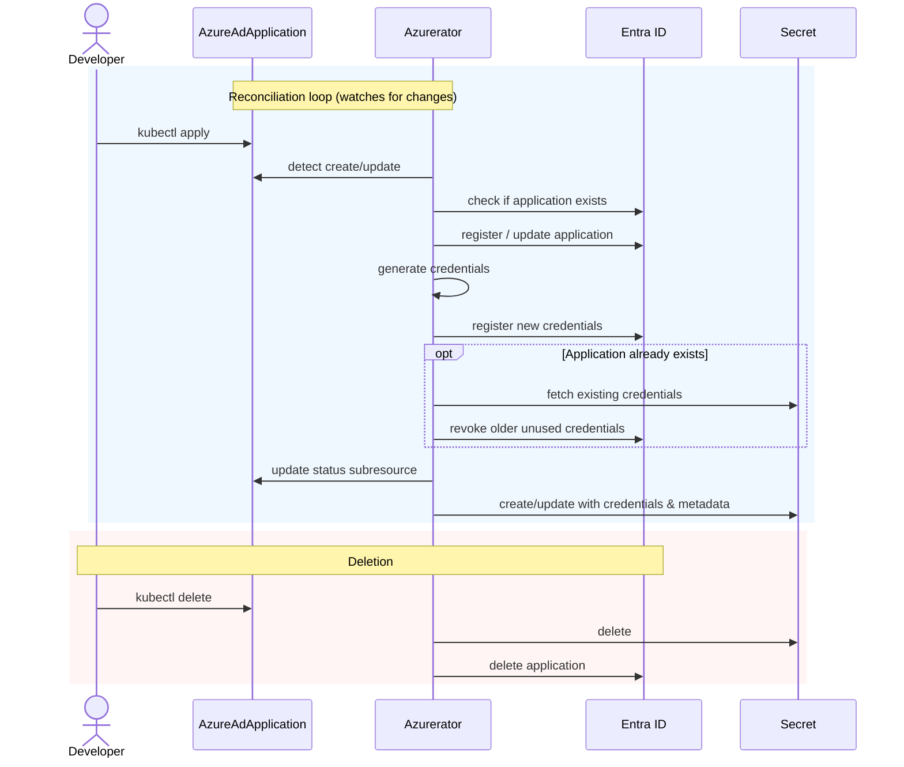

<!-- omit in toc -->

# Lifecycle

Whenever an `AzureAdApplication` resource is created or changed in the cluster, the operator will accordingly create or
update the equivalent resources in Entra ID (formerly Azure AD) to reflect the desired state.

## Overview



1. Developer applies an `AzureAdApplication` resource to the cluster.
2. Azurerator detects the change and registers (or updates) the corresponding application in Entra ID.
3. Credentials, service principal, delegated permissions, and pre-authorized clients are configured.
4. A Kubernetes `Secret` is created with the credentials and metadata the application needs at runtime.
5. On deletion of the resource, the Entra ID application is cleaned up (unless `azure.nais.io/preserve=true`).

When `spec.secretName` changes or the annotation `azure.nais.io/rotate=true` is applied, credentials are rotated with zero-downtime semantics.

## Detailed operations

The following is a detailed overview of operations performed per reconciliation.

- [1 New applications](#1-new-applications)
    - [1.1 Display Name](#11-display-name)
    - [1.2 Authentication Platform](#12-authentication-platform)
        - [Application Identifier URI](#application-identifier-uri)
        - [OAuth2 Permission Scopes](#oauth2-permission-scopes)
        - [Redirect URIs (optional)](#redirect-uris-optional)
        - [Logout URLs (optional)](#logout-urls-optional)
        - [Application Roles](#application-roles)
    - [1.3 (Pre-)Authorized Client Applications](#13-pre-authorized-client-applications)
    - [1.4 Service Principal](#14-service-principal)
    - [1.5 Delegated Permissions](#15-delegated-permissions)
    - [1.6 Credentials](#16-credentials)
    - [1.7 Group Assignment](#17-group-assignment)
    - [1.8 Single-Page Applications](#18-single-page-applications)
    - [1.9 Principal Assignment Required](#19-principal-assignment-required)
- [2 Existing applications](#2-existing-applications)
    - [2.1 Credential Rotation](#21-credential-rotation)
- [3 Cluster Resources](#3-cluster-resources)
    - [3.1 Secret](#31-secret)
- [4 Deletion](#4-deletion)

## 1 New applications

Any application that does not already exist in Entra ID will be registered with the following configuration:

### 1.1 Display Name

The application in Entra ID will be assigned a display name of the following format:

```
<clustername>:<namespace>:<metadata.name>
```

### 1.2 Authentication Platform

By default, a **Web API** is registered as the authentication platform for the application, allowing for usage in _OIDC/OAuth2_ authentication flows with Entra ID. 
This means the application can be used for both accessing and exposing
Web APIs, handling both end-user logins with OIDC and on-behalf-of flows and/or act as daemons for service-to-service
communication.

#### Application Identifier URI

The Application Identifier URI uniquely identifies the Web app within the Entra ID tenant and is usually used as a scope
of a service-to-service token request.

Azurerator registers the following Identifier URIs:

```
api://<clientId>
api://<clustername>.<metadata.namespace>.<metadata.name>
```

where `clientId` is the Azure Application / Client ID, e.g. `api://4f6fae71-89da-46ff-a6d5-04d27d76eb1a`.

Other applications may use this identifier when requesting access tokens for the application from Entra ID, e.g. by
providing the scope `api://<clientId>/.default` or `api://cluster.namespace.app/.default` in the request.

#### OAuth2 Permission Scopes

A default set of [OAuth2 permission scopes](https://learn.microsoft.com/en-us/graph/api/resources/permissionscope?view=graph-rest-1.0)
are registered for the application. These are exposed to consumer/client (pre-authorized) applications for the on-behalf-of flow.

Optionally, one can also define custom scopes for each consumer application if one desires more fine-grained access control.
Details here: <https://doc.nais.io/security/auth/azure-ad/access-policy/#custom-scopes> 
(`spec.preAuthorizedApplications[].permissions.scopes[]`).

#### Redirect URIs (optional)

Redirect URIs are URIs that the Authorization Server will accept as destinations when returning authentication
responses (tokens) after successfully authenticating users. Often referred to as reply URLs.

These are registered according to the list of URIs defined in the `AzureAdApplication` resource, i.e. `spec.replyUrls[]`.

See <https://learn.microsoft.com/en-us/entra/identity-platform/reply-url> for restrictions and limitations.

#### Logout URLs (optional)

`spec.logoutUrl` defines the `LogoutUrl` that Entra ID should send requests to after sign-out from another application
in order to properly implement single-sign-out (front-channel logout).

See <https://learn.microsoft.com/en-us/entra/identity-platform/v2-protocols-oidc#single-sign-out> for
details.

#### Application Roles

An Application Role (AppRole) can be used to enforce authorization in the application. The operator automatically
registers an AppRole called `access_as_application`.

This enables an additional option for authorization checks for service-to-service calls, where the receiving client API
should validate that the calling application has been assigned the role and thus been given access to this application.

The role should be present in the `roles` claim within the access token obtained from the OAuth2 client credentials
flow.

As with _scopes_, the operator also supports custom definitions of roles that can be granted to client/consumer applications 
that enables more fine-grained access control. 
Details here: <https://doc.nais.io/security/auth/azure-ad/access-policy/#custom-roles> 
(`spec.preAuthorizedApplications[].permissions.roles[]`).

### 1.3 (Pre-)Authorized Client Applications

Pre-authorized client applications define the set of client applications allowed to perform
[on-behalf-of flow](https://learn.microsoft.com/en-us/entra/identity-platform/v2-oauth2-on-behalf-of-flow)
to obtain access tokens intended for the application. This authorization is enforced by Entra ID in the case of
the `on_behalf_of` flow.

It is _not_ enforced for the `client_credentials` flow unless assignment requirement is explicitly enabled for the
application (see [1.9 Principal Assignment Required](#19-principal-assignment-required)).

These are registered according to the list of applications defined in `spec.preAuthorizedApplications[]` in
the `AzureAdApplication` resource, with the following caveats:

- `spec.preAuthorizedApplications[].name` must follow the format `<clustername>:<namespace>:<metadata.name>` in order to
  correctly reference the intended application
- The operator will attempt to register these in a "best effort" manner.
- Any legitimate errors will be retried, however applications that do not exist will be skipped and not registered as a
  pre-authorized application.
- It is thus the user's responsibility to ensure that applications defined in the list of pre-authorized applications
  are (eventually) consistent.

The operator will register and grant admin consent for the **OAuth2 permission scopes** defined previously for all
pre-authorized applications registered to the application.

Each pre-authorized application will also be assigned the **AppRole** described earlier.

### 1.4 Service Principal

A [service principal](https://learn.microsoft.com/en-us/entra/identity-platform/app-objects-and-service-principals#service-principal-object)
is registered and connected to the aforementioned application.

This enables us to register and automatically grant admin consent for [delegated permissions](https://learn.microsoft.com/en-us/entra/identity-platform/permissions-consent-overview#types-of-permissions) for the application.

### 1.5 Delegated Permissions

The operator will by default configure the application with the following delegated permissions:

- `https://graph.microsoft.com/openid`
- `https://graph.microsoft.com/User.Read`
- `https://graph.microsoft.com/GroupMember.Read.All`

It will also automatically grant consent for these permissions to the application, allowing the application to perform
sign-ins and reading basic user profile information without having to prompt the end-user for manual consent.

See <https://learn.microsoft.com/en-us/entra/identity-platform/permissions-consent-overview> for more details.

### 1.6 Credentials

During application registration, a set of application secrets (or 'passwords') as well as self-signed certificates are
generated and assigned as valid authentication credentials for the application.

The validity for these are by default set to one (1) year, however the operator also has [built-in support for rotation
of these credentials](#21-credential-rotation).

The unique identifiers (which can be looked up within Entra ID) for these keys are stored in the Status subresource for
the resource, i.e. in the fields:

- `status.passwordKeyIds`
- `status.certificateKeyIds`

These fields thus denote the currently used set of credentials.

See <https://learn.microsoft.com/en-us/entra/identity-platform/howto-create-service-principal-portal#option-2-create-a-new-application-secret>
for details.

### 1.7 Group Assignment

`spec.claims.groups[]` is a list of Object IDs that reference Entra ID groups to be assigned to the _Service Principal_
belonging to the `AzureAdApplication`.

All groups assigned are emitted through the `groups` claim for tokens issued to the Application. This can for example be
used to restrict access to an Application.

By enabling the groups assignment feature, the `AppRoleAssignmentRequired` property is also enabled for the Service
Principal. This denotes whether Entra ID should enforce/require that principals are explicitly assigned to
the `AzureAdApplication` when using the application in a Web API flow such as the OAuth 2.0 Client Credentials flow.

Additionally, any users that should be able to log in to the application using the OpenID Connect flows must be
explicitly assigned to the application through one of the groups defined in `spec.claims.groups[]`. The user _must_ be a
direct member of the group; assignment does not cascade to nested groups. This also applies to tokens acquired by other
consuming applications through the OAuth 2.0 On-behalf-of flow.

If `spec.allowAllUsers` is set to `true`, the group configured by the 
`azure.features.groups-assignment.all-users-group-id` will be assigned to the application. This group should contain
all users that should have access to the application by default.

### 1.8 Single-Page Applications

Entra ID supports the [OAuth 2.0 Auth Code Flow with PKCE](https://learn.microsoft.com/en-us/entra/identity-platform/scenario-spa-overview) for logins from client-side/browser single-page-applications.
However, the support for this must be explicitly enabled to avoid issues with CORS by setting
`spec.singlePageApplication` to `true`.

### 1.9 Principal Assignment Required

The `AppRoleAssignmentRequired` property denotes whether Entra ID should enforce/require that principals are explicitly
assigned to the `AzureAdApplication` when using the application in a Web API flow such as the OAuth 2.0 Client Credentials flow.

`azure.features.app-role-assignment-required.enabled` sets the `AppRoleAssignmentRequired` property for the Service Principal.

Defaults to `false`.

Enabling this will also require the explicit assignment of any end-user that should be able to log in to the application — either directly or through a [group](#17-group-assignment).
It will consequently also affect any use of the on-behalf-of flow - which involves end-users, and thus follows the same restriction as described for the login usecase.

## 2 Existing applications

If the application already exists in Entra ID, the operator will ensure that the configuration is up to date and that
all the required resources/configurations are in place analogously to the case of new applications described
above.

Changes in configurable metadata such as:

- `spec.preAuthorizedApplications[]`
- `spec.replyUrls[]`
- `spec.logoutUrl`

will result in updates to the application in Entra ID so that the desired state represented in the resource is
consistent with the actual state in Entra ID.

The associated cluster resources for the `AzureAdApplication` will also be updated accordingly.

### 2.1 Credential Rotation

Whenever the `spec.secretName` in the `AzureAdApplication` resource changes or when the annotation `azure.nais.io/rotate=true`
is applied, the operator will generate a new set of credentials and associate these with the application.

In order to ensure zero downtime when rotating credentials, the following algorithm is used:

1. A new set of credentials is added to the application in Entra ID.
2. If the application only has a single set of registered credentials, then these will not be revoked.
3. Any set of credentials that exist in `corev1.Secret` resources in use by matching pods (i.e. pods with the label `app=<metadata.name>`) will not be
   revoked.
4. Any other key registered in Entra ID not matching the above will be revoked, i.e. any key deemed to be unused.

Additionally, during reconciliation of the resource, the operator will attempt to add a new set of credentials to the application 
if it detects that the period between last rotation and now is greater than the configured `secret-rotation.max-age` property (defaults to 120 days).
If added, the existing Kubernetes Secret will be updated in-place - which means that you're responsible for restarting any Pods using this Secret.

The previous set of credentials are also revoked in Entra ID about 5 minutes later. This can be disabled by setting the `secret-rotation.cleanup` flag to `false`.

## 3 Cluster Resources

The successful registration of the application in Entra ID will also produce cluster resources for the credentials and
other metadata that the application should use in order to authenticate itself to Entra ID.

### 3.1 Secret

A `coreV1.Secret` with the name as defined in `spec.secretName` is created.

The keys and values contained in the secret are described here: <https://doc.nais.io/security/auth/azure-ad/usage/#runtime-variables-credentials>,
with the only notable difference being `AZURE_APP_PRE_AUTHORIZED_APPS` which in this case refers to applications defined in `spec.preAuthorizedApplications[]`.

## 4 Deletion

The operator implements a finalizer of type `azure.nais.io/finalizer`, which will be processed whenever the `AzureAdApplication` resource is deleted.

The associated application is deleted from Entra ID whenever the related Kubernetes resource is deleted.

OwnerReferences for the aforementioned child resources are also registered and should accordingly be automatically garbage collected.

One can prevent deletion of the resource in Entra ID by applying the annotation `azure.nais.io/preserve=true`.
